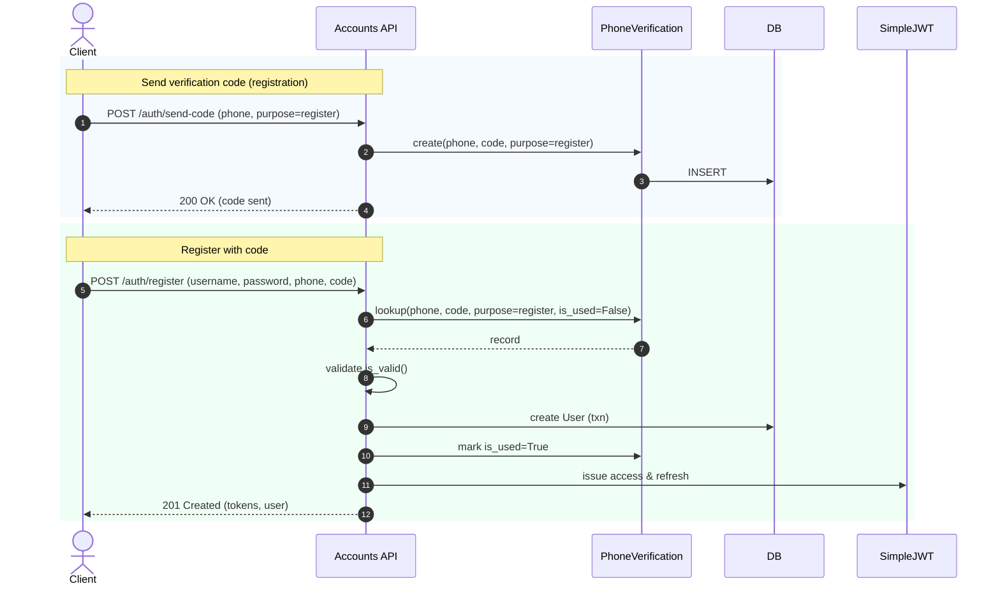
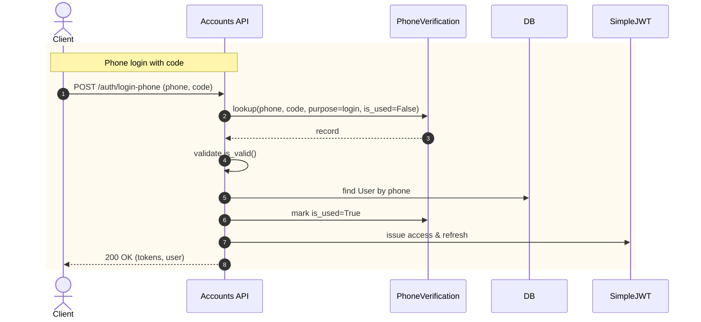
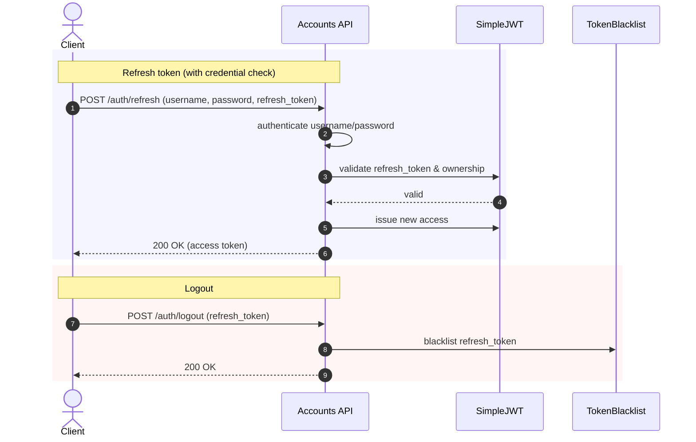

<!-- This is an auto-generated comment: summarize by coderabbit.ai -->
<!-- walkthrough_start -->

## Walkthrough
Introduces phone-based verification and JWT authentication across the accounts app. Adds a PhoneVerification model, admin registration, new serializers, function-based views for send-code/register/login/refresh/reset/current-user/logout, updates URLs, and configures SimpleJWT in settings. Adds comprehensive API documentation for the new flows and token lifetimes.

## Changes
| Cohort / File(s) | Summary |
|---|---|
| **Documentation** `accounts/API_AUTH_DOCUMENTATION.md` | New doc detailing JWT auth, phone verification flow, endpoints, token lifetimes, headers, and sample payloads. |
| **Models** `accounts/models.py` | Made `User.phone_number` unique/null; added `PhoneVerification` model with indexes and `is_valid()` (15-minute window). |
| **Admin** `accounts/admin.py` | Registered `PhoneVerification` with custom `PhoneVerificationAdmin` (list/search/filter/ordering/read-only created_at). |
| **Serializers** `accounts/serializers.py` | Added password min_length=8; introduced `PhoneLoginSerializer`, `VerifyCodeSerializer`, `LoginSerializer`, `RegisterSerializer`, `ResetPasswordSerializer`; imported `PhoneVerification`. |
| **Views (Auth flows)** `accounts/views.py` | Replaced class-based user views with function-based endpoints: send_verification_code, register, login, login_with_phone, refresh_token, reset_password, current_user, logout; helpers for code generation and SMS; JWT issuance/refresh/blacklist. |
| **Routing** `accounts/urls.py` | Removed user CRUD routes; added auth routes for send-code, register, login, login-phone, refresh, reset-password, current-user, logout; updated view function names. |
| **Settings (Auth config)** `soapify/settings.py` | REST_FRAMEWORK set to JWT-only; SimpleJWT lifetimes fixed (2d/10d); configured header types/name and user ID field/claim. |

## Sequence Diagram(s)

## Estimated code review effort
🎯 4 (Complex) | ⏱️ ~60 minutes

## Poem
> A whisk of code, a hop of light,  
> I text a moonlit digit bright.  
> Tokens twirl, two days they gleam,  
> Ten for dreams of refresh-stream.  
> Carrots cached, sessions tight—  
> Verified, I bounce in flight.  
> JWT winds beneath my night. 🥕✨

<!-- walkthrough_end -->
<!-- internal state start -->

<!-- DwQgtGAEAqAWCWBnSTIEMB26CuAXA9mAOYCmGJATmriQCaQDG+Ats2bgFyQAOFk+AIwBWJBrngA3EsgEBPRvlqU0AgfFwA6NPEgQAfACgjoCEYDEZyAAUASpETZWaCrI5Ho6gDYkuASWbc3mwYuJDMgvDekAQA1mQ4uLDs8AzU8PhYmPSIotgU6vKQBgByjgKUXACMkIAoBJAAqjYAMlywuLjciBwA9N1E6rDYAhpMzN1ssFQYYIiwKpjw3Yj4aNzwAGayAPoCaAwx3dzYnp7d1UX1ORRcE1Mzc7sYOkUAyvh5DCSQAlMMsFwMPLLCjdeABILsMDhNTeMCxMhgNB4JIhFJpDKIjC0Ga5fK4WRgAAsAA4GAA2SCAJMIYM5SKEfpg/jdtFhXrhqNguvxuPE6gBhCgkah0dCcSAAJgADOKAKxgSXEsBS6DSjjiskcSVkgBa7gQyFsKHBJGCuGQ3FgGRIYF2OXoSMSyVS4gy6CxYXgRCoNGQaBOkAAglZfJAJPASAB3ZAESCcr4vMGBL4AKQA6tBovg4plkU70RgNJBfKE0LRaMhoZEvharZBBf1ELhvekMAAaSCefD9Ntu+jcNCIRAR/AUeiCnKhdadqPROahOOQMlgWie9ShygbNEurBMJSIQtpjPwrCeDYkcRsX2ChQYdaevIiiMDdAS5doeR7T6DzPZ3svyqSm+8iCus46wD+ZCFnAXx/JgpCQGQDjjrOXxBiGca+pA6zHJ48jHjaA4iogsiNiakBPokYQRFEUj5HezotugyCCgAjtg0g0LQGhGPoxjgFAZD0Pg6wJIQpDkN6IqjKaXC8PwwiiOIUgyPIu7KKo6haDovEmFAcCoKgmCicQZDKJxCisOwXBUBG9iOMwzjyHIChKFQGmaNouhgIYfGmAYn7vCEiDdGhWwBvU0AABJbAAIgA8ny9QALIAKLFNAAbQL4cXFBozC0G4ABExUGBYga+CZEnCtk9mOfwImwRgpCIEYAaQOQtm0PggKmvmWFVugDBMNgQUhcGYURdF8WJal6WZdluX5ZAcwyCQ8SlkotDtko7KRPATUvoeBF2gkKLiAxrpoeRz6VlENbkOudFbi2hbFpASh3uQ0ZZvEp7rOeYLSJAAAUAZDdIyDQD9GBcOK73vog7Y2CQoHSOBUPZlUkrwyR7YAGobvRfV8ooPiQJUMoehgeDSAAlH+XU9ewyAkJ6bQIVi3D4PtZpcDkWJgGp7b1kgNAUO2nbdtdlFxhQGBoGwhwDkOI5bR2Xb7dL4H3SQwso2BesTmA/aDsOo7toCFCCiEYCy+2WTq0Q7yaJAABiI4IXs4GCVzPPto673dfYPIMJuQMB5F0DQFYYTnpaav9ok9u5qiF1YKx2DwIKpp62xHHfIosj2+645cxgOQ8O+nalvuRahHuDD5OU32/pyaDwWGaAoYGyIjvAABe+ZcAAQkKgp8EkpaUFhHu8PgNBiCKPvc0FxdCXgp5ffY7JYs49CUBQHulxkOTIMDhKSpK7YX5U1+SoS9MUd7AAeCtJgXK7SK9JaeMsCi0eaS05AwDU2YOUPg6wRwOXaPtIgKAsA80oPLbcfoZ4UGgb6d0c8wx7nsG/KItBqBd0bBQbAYgHzIEgXwWW8kRBiEwWOaQZdT5QSSIHBg7V57hznHWfWaMIJYDbvBBywESBsSzl8WW8tFYmxVqONB6AyzqBbKgnIlsCh/kSNQR2zsOa7V/t8TwewYinkbLA7uIEwICMLHFWifpPD+zYY1eCG1MKjF4CQFEiBJBfBApQMgnwFEBznnQ3AgBMAl9Cnc6fUpz4BnA7Y8YRMDtxNOwbiRhSqWADJ4MW+ZvrdyUAwIxzYT71QQs/LmFBzKzyGKeDhyRxDSB4pAYotZgYYHwOUypnFDi1JSO9UQxS8lURXHeOgtN0kpTMdAqSpNeFhkjAhdYVCxRJToPARwBhiqFR4n5AKI0zTdFLMwfaGhuCuC2SVMqAYKriTMkRWqLgynOKaQYKAAYywPO4N0hRxz9qi2bAdAOVggEkAJk9NOIySCeHgYNYao0/kFnOdxKAfI5hNRFImEcoQYz7SKdgJQ1hQXgs3JC4GEYBxGm6eYjIuEGhXD/JcSgLwIYtlpgAbk4bZLFVTkBMvFvS5lrKMjthBVaElRNtwoqLCEQ+tAyEii7h1RRJydxGO/GK8gErnoZA+aqrWXBTG4C2CuRAgR3wgx1lsUB4CLak3bEcCgXMcjtiQFsOMatG5Ck4lsagtN2w5GcH8LYYzPDlktaC61ZRKB2qUP6jsosQ2RDFpavIzrdYoEQO6u0FtBTVV9bgeNRqtg8goCWlJINZTxtVhuA6wNBZ5p9X6tevDSy0u2KG8NwMvX5r9dK5GDYxYigDsqxFWtu5ju8TQUM8Au6Io0FOkgGgRakQoMDTVYLCY6p7Bu7Vac9X7QmRkzJgYclmRbPkgOhShnbmQMJLp2KRQ1IEHUvRyjXlQH8D87xRBkEPljNwQhnEuD7IRbQVVZz5AdO5QEbFiBd1bshZrDayjXQxn5Yyq4LLByMVAiwSAeVSYGOBnh5gBHwhKAMTy0I/L2z8uw94kVRLxWIfzEeqAVg+n1NRPiRRm0uDKqKcrZjWrWPbgPRgYG86kpEYk4/Z8P6/3jjcJAXQCbGwmqQOa+QABeEGAByK1NrKD6fbPptSpnICGbTfgHIln9Nuo9fZntTbcD6dpgYVTUBA0UGDZ25AengaGcjcZigznSbuc82p4td4z18EC9Zp1tmSD2cc3aZzja6AFsi159TxrS3lvgnp2UUWoA1vyAdBLDbvVZeoKZjzuW81dQwLhJN0Lw0JZc7VtzrYPMca44GYMjB0WkBA+B05i7l0kEHZQddxKxMtlFfNiF+Y5N8eHZ0ldKaR2LLHVQ7uCGVvbihZ4SZ0zqouV8SQBZtkUYrK4Gslcmztm7LAEYUDhyKPQv3OcoqVysm3NMpJGqTgnn3peS1N5DRAMXf5WckL0a+AxnKLGJ4ec/zUxOCoKIJHD5kZfZgGIYB2302Q0NQKn2iM/aLsNuC5j1DICYOXJsLIzRYTx4YwnOnoCkK+MjoxGAYjc95+2Ea8A87C/Yu2THnhJdLqhx8zaL5lWHdJX1L7MKyfwsp5R6nmZt4jmrKCx6avjtqURuO/zskEdgJjZd3NNXaAFtdVmj1LbHXppBk/Yb3MvzWWm6LO3kt9qG3POW02qt2OBk+fQNZ7IFGq8lS2LgtABBbHZC+r4engtWi2LRU3F79OaOHPApQz8gbAyM4j2NJB6YO27Zlp3faFcx8zXnv08BaDAxyJ4dY9M2CJEUPrxP279d/FEDEFAIkA5qUzdvSIMKJAd/oE/ZD5M5SqpptdLEcS7Xl077WuBaW6DpNabTjF+T6PCqwDkByqcrxfFmHEgsx7rlxeGTGK9gznDDPvSQCpj6QkfARwL6/SDS4YkOUArs4YYa9gnoSmkiMOwGkAAABlXrbhQCgbCkJt+CgfylgZrCgR9sFBrtTlgdSKRqgaQRoGis4NAe1sDA5M/FsN4E1IkDphTO2AToLnLrTFgTGCgdQbQRQPQWGowWgMwawUQOwZwZzjwTzlLqjuLuxHLtLjhLwSgdKsUIsiAa+hrutgVKgSPmnAQVgEQeTgciQVTpBlgU/CpmpqIeWPYblmgTbuAjcNYcIY4eIZIWQNIbABwTKHwVFi4WpB4brjQXMCITAV3kwSwX4ewWSMEapqEY3gWuEd9hoDFMKB4GwN4Q6PgNanEr6mWBoSEWpigcfoYdQcPPgPgN4JgN4R9EiDkjpq7H6DkMkSkVAGgTZjkBkb/JEXQTET4fEWwQEVKBbJaCkNIDpgANpBZbYmZmYDoAr5jubthBbB4YD2ZNAaw7HxqLHSBh6yJmy0D2ZWDKxnGQDIwTjuYAC6XRUAceaAzhFRqe6e2OWeVmVq+eSeJ8+mKB5RPR+0ZeQMemcx1BvgWI/+JGMRiA8xOe5AUaGB4WSg+mjx7YUJMJz8cJ7WCJcx5maRdWjx9xQJuWce8cXQwJqBH0beS+p4XePefeHAthz4weHCMY4++woYy+Giq+WAFMVMNMZ8HS84J0DsXWTeoQAp6+wpPoHmBgUyF4F2s+goN2Sy92kAj2GyzAlyOybyeyFho0Vws6p4/clA1Of2Oy1ygOVU5kDgoO8g4OI2H60e4axhfUn+bCFGxwXw1G7Y/+/YWI5iwSA2SE6wewXw96xBSwG4HeFpFA1O0qKUt4I4X4L4qqYIjglcEe8iUhlEwMxIpOWA/KAoNWLK+QCZlA0q0JTYigCqlCPi7Uiypp1ZSZ+uDg3y2KPAoKx0IosS8S7ojYWQe8js+03QW2JSMMpWImJAex3YlZZpA8lAs5EqsgJMSgS57Zs5C5+0255pq5uWqxq6B5K5FAs5tx54lxeZtAZ5iZUO0EFcKGt65SNA7oYZoBHCV0EZUZWsuifoYs5i/+os5ibZ5pfUHJ3wJAsgGQ9AAcG0IopxqsN4JCrO6S5gWS7+r53pXw16P+r5f+ABVST6wBA24BbpX6PZLyIGxphy4F55eu0GVKcGc5e6MSHOhGuuIMlBKBlBXF32LFVSgqmB+ufFnFpBQlNGVwS2LGR2LYKBUejhcBv6HI142ASBZMsZDFiZ1OFs6qfKVw5Zwo95dunaqByFo4WBzFH0+0iqyAKBOllpQx0RDBEYeIJAWw7aqhVMYx/hOmxZWB5KlKKB7l6gnl3lChJAil0qfIBlBhXAKBG6e5GAplolWuFOwUTlSZkGUOcVwmiFhhKB65m5JAaVphcKmVcZVZh5OV5yeV8VhViVKV5VsK2l8ZtV1ODVBVMeiVJ5YsrVGVlh1Vy5uluVqKjVvVqBV5uAN5cid5HV55FV7VNVjFuVSp525kap124Yt2yy2KD26yz2JUhpb2/kdFwUeQgxv2+pJ6NylU9yIODkYODUrpkBNxJo+AUg9ANCd+KSpoHMtAvsQUXAAc9R9A/KTQosxlNAeMu1mGlAyMTY4YUg9QmlcNiyh8IpIMsswUf4uN3QwAPMHA3AMQeg3Qde14lG54A5HOV1icYs5c/aJA5qnw9oUSo+y8PMXIwS6p6QnIp03Q2xf4DosAQtXYuiDk3ysCyAEY/ivC4Q31f4gorNj4z4SqrZgQa4f+nMK8vMs5rScI0MgNwNbOTVgt/M2IQsgtSxAqot4t3YyciQDt+0xsoKTtYtliaMHtk5xxuAxsVxqs3EuWGMCIc8C85kXNQUCVgtls1s/tNCDs9tkszs7Y3u0kzM70oFTUmcsw5iHSRtv4EgLcCIGcEi+8ut3N0qrsI0YgjEUtawTUjOrphhyd+xXKvC/01sGZN2+4wtwM+0pEpYZS2xeeu1de7obdTseAHdfi3dQMvdGgKdM9A9zOQoQkIky9xqN2UepV/AFARACwg824AmiyGdIQhi3UMQjODRFAdKOQ/YkknC0wiSDs4dikS8ldQUGFd12FF6+uX+Qm05d6IkQZgB+9PA5FPGEBzSqZQNetzEn1StlBsZV1Vpl5SDdAiVicsAQWBNlmi9kN0NmWGNEYWgWaN2wM8a0iJAOm+mssYARq1Wwo7m5JamyMitWDFl1AuD9DVwwURNIQJNZN3QBDu1+4/KSN+Q12JAaNQGYKu15DY9kYVD0uCstDfDlAy4542gngrDUOcDptSS0tTdAG8j9AQ1o0aDkG9hPRU9E51lcSsYp8qBi92xphQ9G9rj4jS9+xyjEYbDdjyIDtzs3QjjtkGE3jkYfdEteAHjNAw996KBbjsT29u1QJUAhjCDBh+usZi95yIMc9ASmKmQF13Q1j5ytMtjqBlteeC2GQWwakQV+2RBwTltgspMYTDWFRttzTHsrTztttXTs5KB7jPF/T9jGAwzLho9T8JaoKfTfAAzYt2xbtVo0zPTfCsw6e0MizqB9tXtswGzPR44JxgdVl4zSzBzftAdt5xzqBcd7A2alAezyz3QjzNsss9zozqTrzU9oTilRgypYIqpcyfNiyd2B12pR1epL2p172ZT+TFyL2tpD1wOdkTpzyb1RgyM7lXClVw1SL+uiYEIF9t0XwoteYx23uOsJu/xmQ7oh4tcyMqt0YbCHiYY7wN9ys/ZP1DKUdbO3uxC54ZS2EGAddGItoIoV0vdCi5LWE041JLeSuArXItTfx26jT9qvCM2Aq2xEsfjczOsesqM2zx4oe+W5znqeQ8dzzerqTtZsqDZbNIyfpjDMjMKSQngpaXIdykkdT8lDTs+DstTiAzAZ8qtloYalAUeiuIoSgPIMJ4rEB/AWAyqGuI17ZXInp24sl5ALVi1iZ+MhMG5pMaV7YBbq1RbH1ur5bH1E4c1ZxaVzNg605HdkTXctLGrkKs+lefRGjttGxvJjJwoyAYuecX0IDzjSC6jf4xrf4XWbLkiDKg9B+L4LO5cew24nKz119dLo+lKHq0qLwO8hC+Z7dzFgouAeQ5ckAh4AiZ8n4EMytWzsA9M+2Ui6jSst5p0VLL0UOG6vL45giLjXc3bfUvbHuyWdD2x7mL717csyA97x4lCHsCFg43Us65kssnK4Hx2qAu7IoR7UOyMpr4Eg5cKLNbOhzsAOzv4foGQcC3un7MiVrHtVL0g7YGr4cxtz+lpCA3ALaSADgQMGttkT734x40qjbKFpz4pon+7PbcyfbSWOQdDcn4e81Q7Gl8jS707FAESuZ81bV0QUwiAW7i2f4u7yAeHjEh7dosVNr7A+nJtetvCCHt7Tl9AHz8nFAnK79i89AzkvgiAAYHNzoJ+UOC5uiArnO+wRqen2CB+jCZHAi8HN7mEDg4M34l45npAzNqtQksBOBiAQHsr3uyqYrEr0wUrFd8D3NnK2cX1SF+Qz6r6qrYSjABlQHJCZCCH8uUATKyAMUQgcEnSG75n1XqHfAjcyiqQMKzAeAwyDsiCXoo74644xqoE6jZsMQWw3ixoQgEYk4aHxtf1pApo6ST5MEb1CgJwikPidKZAXxVEMI1oot7O4YWIT3X9bOlefZtXinfUDsR0gPKHE9jCI4h9TwFpv7qcMSir46QZdSa4tnropEnQmixt6KtAm8RAP9b+uSOF43bC+FwDZSYDJFQBkDX5b6jS71lJQ+5tKBdJ6r9TGAWrSgwMGcHEfBsK5h2uwUSLGT0Lg+9oU1LPKMOrgea6PPjYfPhBeTPj5yIvjP4v/GtJUv2x3PYi7E8vFVAvVVwvUOavMdkvm9hrAw8zVoOvec+v/PSv0TNhJvccTPEvdJNHdHZAtvevhaBvjvUYzvzxrv6vXD5vvCE4mnZxPvvP/viLyvsgqvIfZvdJPndrMf9viv8fTvKvLvYvKfWvqTGffvDv2fgfufwf+f1s6jRVdJW9/jxffP3kmvFv09uAjfcfgv3QxvUBtdx2zPdJfrwoAbBeQbpMVDnfRvCfIvNd4r/f7vUvob4b/3ueoWNeCvZhAfZBBjPGoiitqCfbtPJXZX4jVTH1nD9AKBJXIlUNjYMNCjKjfrKQ+4t/uA9/aEpDfPDsV/8Vkj540jqNdGrtWBhP8GA+4KRijVkaaUP+49LArxS342FCmLNIxC62ciVc++LYIDqq0VLAsZk3nMFjtQhb7UqkXASKGzFurwsDAywVYBsFkBxkYETdGxrdVRZD8HSjyZ0q9TghukOGzXegCNzG43EUoLwDMK7CoBsBduAySMscFCCnxGMDLeCsbUpbw8pUMANhDYCEHQAtgrsGwAGFSipg4oNgAANJZEUorscKE0E0HhQooaULKHyHmg5QtgfIJoAGBeAvAhBHddtPAnxS4JDwYXR0MoP/ZQAEwxoe9n9ABhsBh2evciPLReT0BKCZAMMIfAwCmhlw+QKQFgBjB3hy89AeVMAy4ABg+QfIIQS8C2DQA4ohgtKFsCaC+BXYKULKKlHsAisYwcMQhCRD/DqDtBQg6KGUIqHFAqhNQuob4AaETh9cAEHGPuGVYihlUwQpMPeyZx3giAeQPqHEBIj5DJoWwSKClADAxQUoNgUoQAE0rA7g4GKPGcAxt2wVg6KJsO2G7CtgxQXQSlBBiRxo4E0KKAYN8Dah7BxQeNPUDcF7DfAMULQb4BShNAYoIMTvPGgdi/DbhAIxwc4KGE40rgWwCEQTywpE9/6uFAZEA1/ygNiK1SMirTworvUEwqlfrmY2qhcB1BwgrQToL0EGDjBOwswfUAsGvDNh6UXwHYKygOCnBLgtwS8FhTUC1gmwegeIEYH1VcscUMNFwEJKbcQ0YgyMCOD24HckwR3DyOF3zAaBfB6o7cPZllHbdxBiorQNqJegMYWwfgs6Nul1EcQ5RO3Q0UoOiRSpQ6GAc0X+wyAYkDakYaUfpj1Hyjdu+3EliQFVFGj/BDol6FqJDGWj7izSEkQgXJHIEXgQwqwE0BShbBDwGgAoUUNcGlDyhlQ6obUPqGPDNYgo2gSKJlq5UJRUo6IIDEozshGC+0EUjph5jAxbMGgOkAkKCyHgwohQ4oVsCSi+BigEUIQfZgADMkodzLTG6ZQBtCEYUGtWOhS1jWhCJcUIqSCHwE1KiBcxlwATFJQkxKYtMR0KpHdCcxfQvMYMIaFFiVgQougROFFFEAuqFYwwheDoDzi0AwMRcY2JCDNj9wbYjABIA7HpgtgB4robFADD7CXg9mSoOOMnEtJPRVYtgDWNfHviAIK4yADGPXFxiuG243camPTDpj1h1wnYXsOgCHD3BF4mgcKJvFljxRamSUYYXaTzweApzEINBOnFcAgspw8ePVmjFriyROnCkahMTHJicJ0APCVFA2FbDCJdwh4QKMvEljKJYo2QLOVolsSxSjE44sxI9EzirMzwqwKyPeGfCuRxQfTNxNJH/o+J8YwSXuNwnQj/hgI12MCNBEyTyJ1488LePvE0TKx9E0IB4n5iFpNJXABzOcRMmxjzJmEyycJI0A2StgsInkQiLIlXjSxCkpSZ5NUk+T2ALE2CZozLSd5jJG1FUltQIEalIWJA6Fk9lhYnVeIBgXSIDTKQFE0WoLSyEIzrBoBbIjpZ6k5FUikw3IagDyNpG8hVT+IFkE5Mak7xZpwWctJ3COWEqVTqpAgWgGSDQBkhKgw4/6ISHFCVANpKMcoMOLWgAB2T5AIGJDig1pO0skKkDJDEg6A9AGaYNOkjqBkR5YLYONKyyCQvIhgaqcwAYDcAtWIQf/MaimmhBKpAAbyiyFRUg/YGEO+kQAvB2BhULgIVDPxJQ+QMcAgPUV9BL5IgXxHZAAF9fIUAT6d9KZw0Bn4xqV6foCAA=== -->

<!-- internal state end -->
<!-- finishing_touch_checkbox_start -->

✨ Finishing Touches

- [ ] <!-- {"checkboxId": "7962f53c-55bc-4827-bfbf-6a18da830691"} --> 📝 Generate Docstrings

🧪 Generate unit tests

- [ ] <!-- {"checkboxId": "f47ac10b-58cc-4372-a567-0e02b2c3d479", "radioGroupId": "utg-output-choice-group-unknown_comment_id"} -->   Create PR with unit tests
- [ ] <!-- {"checkboxId": "07f1e7d6-8a8e-4e23-9900-8731c2c87f58", "radioGroupId": "utg-output-choice-group-unknown_comment_id"} -->   Post copyable unit tests in a comment
- [ ] <!-- {"checkboxId": "6ba7b810-9dad-11d1-80b4-00c04fd430c8", "radioGroupId": "utg-output-choice-group-unknown_comment_id"} -->   Commit unit tests in branch `cursor/implement-mobile-token-authentication-and-security-48c6`

<!-- finishing_touch_checkbox_end -->
<!-- tips_start -->

---

Thanks for using CodeRabbit! It's free for OSS, and your support helps us grow. If you like it, consider giving us a shout-out.

❤️ Share

- [X](https://twitter.com/intent/tweet?text=I%20just%20used%20%40coderabbitai%20for%20my%20code%20review%2C%20and%20it%27s%20fantastic%21%20It%27s%20free%20for%20OSS%20and%20offers%20a%20free%20trial%20for%20the%20proprietary%20code.%20Check%20it%20out%3A&url=https%3A//coderabbit.ai)
- [Mastodon](https://mastodon.social/share?text=I%20just%20used%20%40coderabbitai%20for%20my%20code%20review%2C%20and%20it%27s%20fantastic%21%20It%27s%20free%20for%20OSS%20and%20offers%20a%20free%20trial%20for%20the%20proprietary%20code.%20Check%20it%20out%3A%20https%3A%2F%2Fcoderabbit.ai)
- [Reddit](https://www.reddit.com/submit?title=Great%20tool%20for%20code%20review%20-%20CodeRabbit&text=I%20just%20used%20CodeRabbit%20for%20my%20code%20review%2C%20and%20it%27s%20fantastic%21%20It%27s%20free%20for%20OSS%20and%20offers%20a%20free%20trial%20for%20proprietary%20code.%20Check%20it%20out%3A%20https%3A//coderabbit.ai)
- [LinkedIn](https://www.linkedin.com/sharing/share-offsite/?url=https%3A%2F%2Fcoderabbit.ai&mini=true&title=Great%20tool%20for%20code%20review%20-%20CodeRabbit&summary=I%20just%20used%20CodeRabbit%20for%20my%20code%20review%2C%20and%20it%27s%20fantastic%21%20It%27s%20free%20for%20OSS%20and%20offers%20a%20free%20trial%20for%20proprietary%20code)

🪧 Tips

### Chat

There are 3 ways to chat with [CodeRabbit](https://coderabbit.ai?utm_source=oss&utm_medium=github&utm_campaign=mehran-shabani/soapify_back&utm_content=1):

- Review comments: Directly reply to a review comment made by CodeRabbit. Example:
  - `I pushed a fix in commit <commit_id>, please review it.`
  - `Open a follow-up GitHub issue for this discussion.`
- Files and specific lines of code (under the "Files changed" tab): Tag `@coderabbitai` in a new review comment at the desired location with your query.
- PR comments: Tag `@coderabbitai` in a new PR comment to ask questions about the PR branch. For the best results, please provide a very specific query, as very limited context is provided in this mode. Examples:
  - `@coderabbitai gather interesting stats about this repository and render them as a table. Additionally, render a pie chart showing the language distribution in the codebase.`
  - `@coderabbitai read the files in the src/scheduler package and generate a class diagram using mermaid and a README in the markdown format.`

### Support

Need help? Create a ticket on our [support page](https://www.coderabbit.ai/contact-us/support) for assistance with any issues or questions.

### CodeRabbit Commands (Invoked using PR/Issue comments)

Type `@coderabbitai help` to get the list of available commands.

### Other keywords and placeholders

- Add `@coderabbitai ignore` anywhere in the PR description to prevent this PR from being reviewed.
- Add `@coderabbitai summary` to generate the high-level summary at a specific location in the PR description.
- Add `@coderabbitai` anywhere in the PR title to generate the title automatically.

### CodeRabbit Configuration File (`.coderabbit.yaml`)

- You can programmatically configure CodeRabbit by adding a `.coderabbit.yaml` file to the root of your repository.
- Please see the [configuration documentation](https://docs.coderabbit.ai/guides/configure-coderabbit) for more information.
- If your editor has YAML language server enabled, you can add the path at the top of this file to enable auto-completion and validation: `# yaml-language-server: $schema=https://coderabbit.ai/integrations/schema.v2.json`

### Status, Documentation and Community

- Visit our [Status Page](https://status.coderabbit.ai) to check the current availability of CodeRabbit.
- Visit our [Documentation](https://docs.coderabbit.ai) for detailed information on how to use CodeRabbit.
- Join our [Discord Community](http://discord.gg/coderabbit) to get help, request features, and share feedback.
- Follow us on [X/Twitter](https://twitter.com/coderabbitai) for updates and announcements.

<!-- tips_end -->
